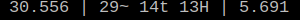

Queries and stores Wakatime statistics:

- today's coding time
- this week's coding time
- this week's coding time per language (top 3)

Useful for status bars, etc.

## Installation

```bash
git clone https://github.com/vxsl/wakawidget
cd wakawidget
npm install
chmod +x ww-print.sh ww-query.sh
```

## Usage

```bash
# store data (probably as a cron job)
npm run query
> ww-query.sh

# show data
> ww-print.sh today
5.044
> ww-print.sh week
30.556
> ww-print.sh week-langs
29~ 14t 13H
```

## xmobar example



```shell
# ~/.config/xmobar/xmobarrc
Config
  { font = "Liberation Mono 13",
    commands =
      [
        Run Com "/home/kyle/bin/wakatime/wakawidget/ww-print.sh" ["week"] "waka-week" 100,
        Run Com "/home/kyle/bin/wakatime/wakawidget/ww-print.sh" ["week-langs"] "waka-week-langs" 100,
        Run Com "/home/kyle/bin/wakatime/wakawidget/ww-print.sh" ["today"] "waka-today" 100,
      ],
    sepChar = "%",
    template = "}{%waka-week% | %waka-week-langs% | %waka-today%"
  }
```
